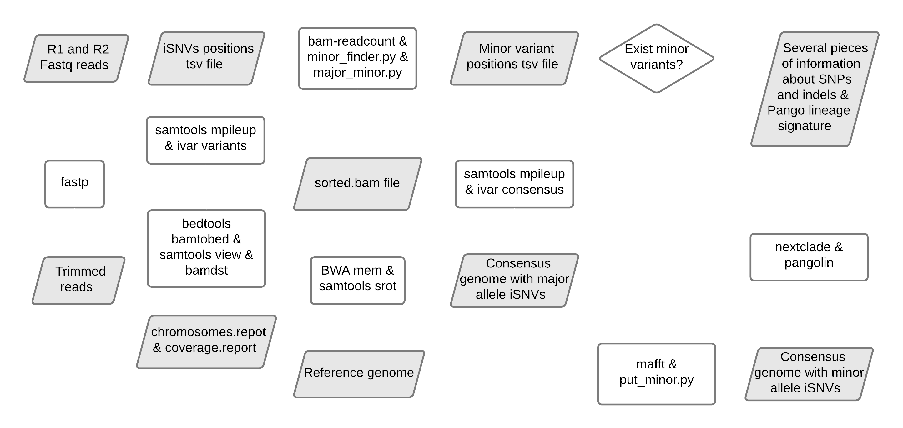

ViralFlow
=========

This repository contains a set of scripts to performs a reference guided genome assembly of SARS-CoV-2. Python scripts were developed based on the wuhan SARS-CoV-2 reference genome NC_045512.2. The workflow was developed to work with Illumina paired-end reads. Tests with other technologies should be performed.

<<<<<<< HEAD
If you use this workflow for academic purposes, please cite:  `ViralFlow: an automated workflow for SARS-CoV-2 genome assembly, lineage assignment, mutations and intrahost variants detection <https://www.medrxiv.org/content/10.1101/2021.10.01.21264424v1>`_

=======
If you use this workflow for academic purposes, please cite: `ViralFlow: an automated workflow for SARS-CoV-2 genome assembly, lineage assignment, mutations and intrahost variants detection <https://www.medrxiv.org/content/10.1101/2021.10.01.21264424v1>`_.

.. image:: images/workflow_develop.png
>>>>>>> develop
   :width: 600
   :align: center

=====
Dependencies
=====

* BWA Version: 0.7.17-r1188
* samtools 1.9 Using htslib 1.9
* fastp 0.20.1
* iVar version 1.3.1
* bam-readcount version: 0.8.0-unstable-7-625eea2
* Python 3.8.1
    * argparse 1.4
    * pandas 1.0.1
    * numpy 1.20.3
    * biopython 1.74
* mafft v7.453 (2019/Nov/8)
* nextclade 1.4.5
* pangolin v3.1.11
* bedtools v2.27.1
* bamdst 1.0.9
* seqtk 1.3-r106

=====
How to install
=====

You can install viralflow via pip

.. code-block:: text

  git clone https://github.com/dezordi/ViralFlow.git
  cd ViralFlow/
  conda env create -f envs/viralflow.yml
  conda activate viralflow
  pip install -e ./

The recommended way to run ViralFlow is via **Singularity container**, be sure `Singularity is installed <https://hub.docker.com/repository/docker/dezordi/iam_sarscov2/>`_. But you can also run via Docker and with local environment. If you plan to run on your local environment, be sure all requirements are met.

====
Quick guide
====

Building and running a ViralFlow singularity container

.. code:: bash

  viralflow --build -singFilePath /path/to/ViralFlow/Singularityfile_test
  viralflow --runContainer -inputDir path/to/input/  \
                           -referenceGenome reference_genome.fasta \
                           -adaptersFile adapters.fasta -totalCpus 4 \
                           -depth 5 -minLen 75 \
                           -containerImg /path/to/viralflow_container \
                           -minDpIntrahost 100 -trimLen 0

Or you can pass a configure file:

.. code:: bash

  viralflow --build -singFilePath ./Singularityfile
  viralflow --runContainer -inArgsFile ./test_files/test_args.conf

Building and running a ViralFlow docker container

.. code:: bash

  viralflow --build -containerService docker
  viralflow --runContainer -containerService docker -inArgsFile ./test_files/test_args_docker.conf

Run locally (Be sure all requirements are met on your machine)

.. code:: bash

  viralflow --run -inputDir path/to/input/data/ \
                  -referenceGenome $FASTA \
                  -adaptersFile adapters.fasta -totalCpus 4 -depth 5 \
                  -minLen 75 -minDpIntrahost 100 -trimLen 75 \
                  -nxtBin /path/to/nextclade \
                  -nxtDtset /path/to/nextclade/dataset/sars-cov-2/ -v

Compile the outputs

.. code:: bash

  viralflow --compileOutput -inputDir <path/to/directory/with/results> -outDir <path/to/store/compiled/results>
  #example
  viralflow --compileOutput -inputDir ./test_files/ -outDir ./test_files/

Check negative controls

.. code:: bash

  viralflow --checkNegControls -negControlLabels <negative_control_sample_code> -pangoCSV <path/to/compiled/pango.csv>
  #example
  viralflow --checkNegControls -negControlLabels Cneg_R1 -pangoCSV ./test_files/RESULTS/pango.csv

Get lineage summary

.. code:: bash

  viralflow --getLineageSummary -pangoCSV <path/to/compiled/pango.csv> -chromCSV <path/to/compiled/chromossomes.csv> -outDir <path/to/store/summaries>
  #example
  viralflow --getLineageSummary -pangoCSV ./test_files/RESULTS/pango.csv -chromCSV ./test_files/RESULTS/chromossomes.csv -multifasta ./test_files/RESULTS/seqbatch.fa -outDir ./test_files/RESULTS/

=====
Files info
=====

Repository directory structure

.. code-block:: text

    ViralFlow/
    ├-Singularityfile                       ### Recipe to build local singularity sandbox
    ├-sars2_assembly_singularity            ### Script called into ENTRYPOINT of local singularity sandbox
    ├-sars2_assembly_singularity_run.sh     ### Script for users unfamiliar with singularity run sintaxe
    ├-pango_update                          ### Script to activate conda and update pangolin, run automatically during docker or singularity build
    ├-setup.py                              ### install instructions for pip
    ├-viralflow
    | ├-__init__.py                         ### viralflow python library definition
    | ├-calls.py                            ### command calls module
    | ├-containers.py                       ### containers handling functions module
    | ├-intrahost.py                        ### intrahost bam processing functions module
    | └-pipeline.py                         ### wrapper functions for running pipeline
    |
    ├-scripts:
    | └-viralflow                           ### CLI ViralFlow interface
    └-images:
      └-workflow.png                        ### image of workflow

Results directory structure

.. code-block:: text

    inputDir/
    ├-reference.fasta
    ├-code_R1.fastq.gz
    ├-code_R2.fastq.gz
    ├-adapters.fasta
    └-code.results/
     ├-chromosomes.report                                  ### tsv file with genomic metrics
     ├-coverage.report                                     ### txt file with all assembly metrics
     ├-code_<fastp/mafft/nextclade/pangolin/bwa/sam>.log   ### txt file with log of tool
     ├-code.<R1/R2>.fq.gz                                  ### trimmed fastq files
     ├-code.depthX.fa                                      ### consensus defined with iVar
     ├-code.depthX.amb.fa                                  ### consensus defined with iVar with ambiguous nucleotideos on positions where major allele frequencies correspond at least 60% of depth.
     ├-code.depthX.all.fa                                  ### in case of minor variant detection, this file contain the 2 genome versions (major and minor consensus)
     ├-code.depthX.fa.nextclade.csv                        ### or code.depthX.all.fa.nextclade.csv in case of minor variant detection, nextclade csv output
     ├-code.depthX.fa.gene<SC2 genes>.fasta                ### or code.depthX.all.fa.gene<SC2 genes>.fasta in case of minor variant detection, fasta with aminoacid sequence of each gene, generated with nextclade
     ├-code.depthX.fa.pango.csv                            ### or code.depthX.all.fa.pango.csv in case of minor variant detection, pangolin lineages information
     ├-code.depthX.fa.bc                                   ### bamreadcount output, with all nucleotide frequencies by genomic position
     ├-code.depthX.fa.bc.intrahost.tsv                     ### tsv file with minor variant informations
     ├-code.depthX.fa.bc.intrahost.short.tsv               ### short tsv file with minor variant informations
     ├-code.depthX.fa.algn.minor.fa                        ### fasta file with minor consensus genome
     ├-code.fastp.html                                     ### html file with fastp quality controll informations
     ├-code.fastp.json                                     ### json file with fastp quality controll informations
     ├-code.sorted.bam                                     ### sorted bam file
     ├-code.sorted.bam.bai                                 ### index of sorted bam file
     ├-code.time.txt                                       ### time in minutes of each step of analysis.
     └-code.tsv                                            ### tsv output from iVar with the frequencies of iSNVs

=====
Disclaimer
=====
* The adapters and reference file should be in the same directory of fastq files.
* The minor consensus version is based only on replacing the nucleotide from the consensus (majority consensus) with the minor allele (supported by 5 to 49% of the reads), without any statistical method to reconstruct quasispecies genomic populations. For minor variants with percentage near of 50%, the results of this step should be curated mannualy owing the possibility of different frequencies from ivar and bamreadcount analysis.
* Using Dockerfile or Singularity a pangolin update will be performed automatically, but periodical updates are recommended (re-building the docker image);
* More information `Here <https://dezordi.github.io/>`_;
