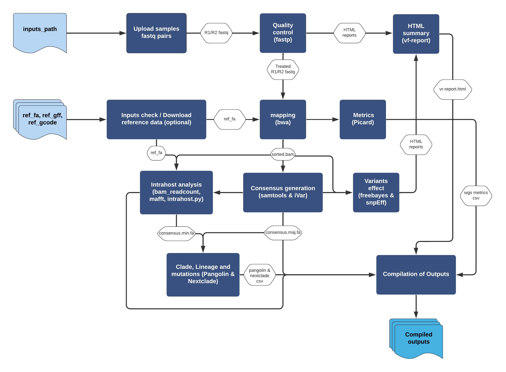

Welcome to ViralFlow's documentation!
=====================================

**ViralFlow** (v1.0.0) is a nextflow workflow for viral genomics analysis
guided by reference. An user friendly documentation can be
accessed here `viralflow.github.io <https://viralflow.github.io/>`_.

  
.. note::

   This project is under active development.

Contents
--------

.. toctree::

   usage
   tasks